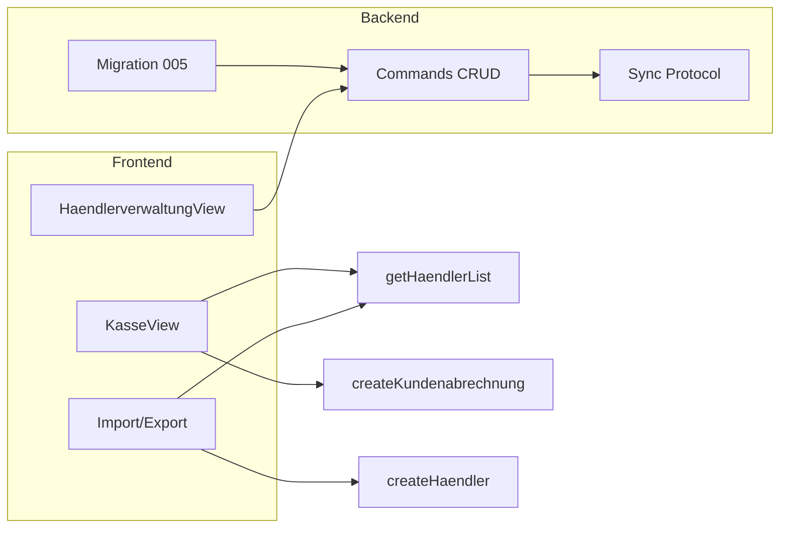

# Händlerverwaltung erweitern

## Ausgangslage

- **Händler-Schema** ([src-tauri/migrations/001_initial.sql](src-tauri/migrations/001_initial.sql)): `haendler (haendlernummer, name, sort)`.
- **UI** ([src/components/HaendlerverwaltungView.tsx](src/components/HaendlerverwaltungView.tsx)): Formular mit Händlernummer, Name, Sortierung; Liste mit Bearbeiten/Löschen.
- **Buchung** ([src/components/KasseView.tsx](src/components/KasseView.tsx), [src/db.ts](src/db.ts)): `createKundenabrechnung` schreibt Positionen inkl. `haendlernummer` ohne Prüfung gegen die Händlerliste.
- **Sync** ([src-tauri/src/sync/protocol.rs](src-tauri/src/sync/protocol.rs), [sync_db.rs](src-tauri/src/sync/sync_db.rs), [commands.rs](src-tauri/src/commands.rs)): `HaendlerInfo` und alle INSERT/UPDATE der Händlerliste nutzen nur `haendlernummer`, `name`, `sort`.

## 1. Datenmodell und Migration

- **Neue Migration** `005_haendler_felder.sql`:
  - `ALTER TABLE haendler ADD COLUMN` für: `vorname TEXT`, `nachname TEXT`, `strasse TEXT`, `hausnummer TEXT`, `plz TEXT`, `stadt TEXT`.
  - Bestehende Spalten `haendlernummer`, `name`, `sort` bleiben (Abwärtskompatibilität und Sync).
- **Nummer ohne führende Nullen**: Keine Schema-Änderung. `haendlernummer` bleibt TEXT; in der UI wird eine Zahl (z. B. 1, 2, 12) eingegeben und beim Speichern als String ohne führende Nullen gespeichert (z. B. `"1"`, `"12"`). Vergleich beim Buchen: Eingabe normalisieren (z. B. `parseInt(trim, 10)` → String) und mit den Einträgen der Händlerliste abgleichen.
- **db.rs**: Neue Migration `005_haendler_felder` in [src-tauri/src/db.rs](src-tauri/src/db.rs) einhängen (Prüfung auf `schema_migrations.version='005_haendler_felder'`, dann `run_migration_005`).

## 2. Backend (Rust): Händler-CRUD und Sync

- **HaendlerItem** und **HaendlerInfo** ([commands.rs](src-tauri/src/commands.rs), [protocol.rs](src-tauri/src/sync/protocol.rs)): Felder ergänzen: `vorname`, `nachname`, `strasse`, `hausnummer`, `plz`, `stadt` (optional/String).
- **get_haendler_list** / **get_haendler_list_for_sync**: SELECT um die neuen Spalten erweitern; bei bestehenden DBs liefern neue Spalten NULL/leer.
- **create_haendler** / **update_haendler**: Parameter um die neuen Felder erweitern; INSERT/UPDATE entsprechend anpassen.
- **apply_haendler_list** ([sync_db.rs](src-tauri/src/sync/sync_db.rs)): INSERT in `haendler` mit allen neuen Spalten (aus `HaendlerInfo`).
- **join_network** ([commands.rs](src-tauri/src/commands.rs)): Beim Übernehmen der Händlerliste INSERT mit allen neuen Feldern (aus `approve.haendler`).

## 3. Frontend: Händlerverwaltung UI

- **Typen** ([src/db.ts](src/db.ts)): `HaendlerItem` um `vorname`, `nachname`, `strasse`, `hausnummer`, `plz`, `stadt` erweitern (optional).
- **Formular** ([HaendlerverwaltungView.tsx](src/components/HaendlerverwaltungView.tsx)):
  - **Nummer**: Ein Feld „Nummer“ (z. B. `type="number"` min=1), Wert ohne führende Nullen speichern (`String(parseInt(value, 10))` bzw. Trim + Parse). Bei Bearbeitung: Nummer editierbar lassen (PK-Änderung = Delete + Create wie bisher).
  - Weitere Felder: Vorname, Nachname, Straße, Hausnummer, PLZ, Stadt; optional Sortierung wie bisher.
  - Pflicht: Nummer und mindestens ein Name (Vorname oder Nachname oder das bestehende „Name“-Feld – je nach gewünschter Abwärtskompatibilität). Empfehlung: Nummer Pflicht; Anzeigename aus Nachname/Vorname ableiten oder „Name“ weiter nutzbar lassen.
- **Liste**: Anzeige z. B. „Nummer – Nachname, Vorname“ bzw. Name/Adresse wie gewünscht; neue Felder in der Zeile oder nur in der Bearbeitung.
- **Neue anlegen vereinfachen**: Deutlicher Button „Neuer Händler“, Formular oben; nach Speichern Formular zurücksetzen und Fokus auf „Nummer“ für schnelle Folgeeingabe.

## 4. Buchungsvalidierung (Kasse)

- **KasseView** ([src/components/KasseView.tsx](src/components/KasseView.tsx)):
  - Beim Klick auf „Abschließen“ (vor `createKundenabrechnung`): `getHaendlerList()` aufrufen, alle `haendlernummer` normalisieren (z. B. `s.trim()` und bei numerischem Inhalt `String(parseInt(s, 10))` für Vergleich).
  - Für jede Position der `validPositionen`: normalisierte Händlernummer prüfen; wenn nicht in der Händlerliste → **Hinweis/Fehler** anzeigen: z. B. „Händlernummer X ist nicht in der Händlerliste. Trotzdem buchen?“ mit Buttons „Abbrechen“ und „Trotzdem buchen“.
  - Bei „Trotzdem buchen“: gleichen Abschluss wie bisher ausführen (also `createKundenabrechnung` mit den eingegebenen Nummern). Kein Backend-Check nötig; Validierung nur zur Fehlervorbeuge im Frontend.

## 5. CSV- und Excel-Import/Export

- **Export**:
  - **CSV**: Händlerliste (getHaendlerList) in Zeilen mit Spalten z. B. Nummer, Vorname, Nachname, Straße, Hausnummer, PLZ, Stadt, Sortierung (und ggf. Name). CSV-String erzeugen (Escaping von Anführungszeichen/Kommas) und per Browser-Download oder Tauri-Dialog speichern.
  - **Excel**: Bibliothek **xlsx** (SheetJS) einbinden; ein Sheet mit gleichen Spalten befüllen und als .xlsx herunterladen (z. B. über Blob + Link oder Tauri save-Dialog).
- **Import**:
  - **CSV**: Datei auswählen (file input oder Tauri open-Dialog), Inhalt parsen (Zeilen/Spalten; Kopfzeile optional). Pro Datensatz `createHaendler`/`updateHaendler` aufrufen (bei existierender Nummer Update, sonst Create). Duplikate/Fehler (z. B. ungültige Nummer) abfangen und anzeigen.
  - **Excel**: Gleiche Logik; mit **xlsx** Sheet lesen, Zeilen iterieren, gleiche Create/Update-Logik.
- **UI**: In der Händlerverwaltung Buttons „Export CSV“, „Export Excel“, „Import CSV“, „Import Excel“ (oder ein kombinierter „Import“ mit Dateiauswahl und Format-Erkennung anhand Endung). Dateizugriff: im Tauri-Kontext optional `@tauri-apps/plugin-dialog` für Öffnen/Speichern; sonst `<input type="file">` und Blob-URLs/File-API für Export.

## 6. Abhängigkeiten und Dateien

- **Neu**: `src-tauri/migrations/005_haendler_felder.sql` (ALTER TABLE).
- **Rust**: [src-tauri/src/db.rs](src-tauri/src/db.rs), [src-tauri/src/commands.rs](src-tauri/src/commands.rs), [src-tauri/src/sync/protocol.rs](src-tauri/src/sync/protocol.rs), [src-tauri/src/sync/sync_db.rs](src-tauri/src/sync/sync_db.rs).
- **Frontend**: [src/db.ts](src/db.ts), [src/components/HaendlerverwaltungView.tsx](src/components/HaendlerverwaltungView.tsx), [src/components/KasseView.tsx](src/components/KasseView.tsx). Optional neue Hilfsfunktion für CSV/Excel (z. B. in `src/utils/haendlerImportExport.ts`).
- **npm**: Abhängigkeit `xlsx` (SheetJS) für Excel-Import/Export hinzufügen.

## Ablauf (kurz)

- Migration erweitert Tabelle; Commands und Sync nutzen neue Felder.
- Händlerverwaltung: neues Formular (Nummer ohne führende Nullen + Adresse), Import/Export.
- Kasse: vor Abschluss Prüfung der Händlernummern, bei unbekannter Nummer Bestätigungsdialog, auf Wunsch trotzdem buchen.
