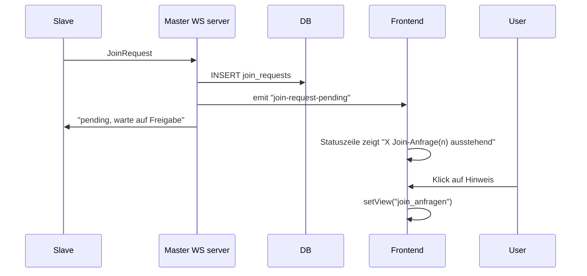

# Join-Anfragen im Master direkt sichtbar machen

## Ausgangslage

- Join-Anfragen werden nur in der Ansicht **Join-Anfragen** (`[JoinAnfragenView.tsx](src/components/JoinAnfragenView.tsx)`) angezeigt, die man über den Startseiten-Tile „Join-Anfragen“ öffnet.
- Die Statuszeile (`[Statuszeile.tsx](src/components/Statuszeile.tsx)`) ist auf allen Views sichtbar (Kasse, Abrechnung, Start, …), zeigt aktuell nur Rolle und Sync-Verbindungsstatus.
- Im Backend wird nach dem Speichern einer Join-Anfrage in `[server.rs](src-tauri/src/sync/server.rs)` (INSERT in `join_requests`) kein Event an das Frontend gesendet; die Liste wird nur per Polling in `JoinAnfragenView` alle 3 s aktualisiert.

## Ziel

- **Im Master** ist sofort sichtbar, dass ausstehende Join-Anfragen existieren – ohne Wechsel ins Menü.
- Sichtbarkeit in der **dauerhaft sichtbaren Statuszeile** (Footer), optional zusätzlich als Badge am Startseiten-Tile.

## Architektur-Überblick

## Implementierung

### 1. Backend: Event bei neuer Join-Anfrage

**Datei:** `[src-tauri/src/sync/server.rs](src-tauri/src/sync/server.rs)`

- Direkt nach dem erfolgreichen `INSERT` in `join_requests` (nach Zeile 211) ein Tauri-Event emittieren, z. B. `join-request-pending`, analog zu vorhandenem `app.emit("sync-data-changed", ())` (Zeilen 358, 372).
- So sieht das Frontend neue Anfragen sofort, ohne auf das nächste Polling-Intervall zu warten.

Optional (nicht zwingend): Ein leichtgewichtiges Tauri-Command `get_pending_join_request_count` könnte nur die Anzahl zurückgeben, um in der Statuszeile ohne die volle Liste zu arbeiten. Aktuell reicht `get_join_requests` (liefert nur `status = 'pending'`), die Länge im Frontend zu nutzen – die Liste ist typischerweise sehr klein.

### 2. Statuszeile: Ausstehende Join-Anfragen anzeigen (nur Master)

**Dateien:** `[src/components/Statuszeile.tsx](src/components/Statuszeile.tsx)`, `[src/components/Statuszeile.css](src/components/Statuszeile.css)`

- Nur wenn `role === "master"`:
  - Pending-Count laden: z. B. `getJoinRequests()` aus `[db.ts](src/db.ts)`, Anzeige = `list.length`.
  - Polling im gleichen Rhythmus wie der bestehende Sync-Status (z. B. alle 3–4 s), damit sich die Anzeige nach Annehmen/Ablehnen aktualisiert.
  - Listener für `join-request-pending` (mit `listen` von `@tauri-apps/api/event`): bei Event sofort Count neu laden.
- Wenn `pendingCount > 0`: In der Statuszeile einen sichtbaren Hinweis anzeigen, z. B. „ · X Join-Anfrage(n) ausstehend“, als klickbares Element (Button/Link).
- Klick ruft eine von `App` übergebene Callback-Funktion auf, z. B. `onOpenJoinAnfragen`, die `setView("join_anfragen")` ausführt.

**App-Anpassung:** In `[src/App.tsx](src/App.tsx)` die Statuszeile um die neue Prop erweitern, z. B. `onOpenJoinAnfragen={() => setView("join_anfragen")}`.

Styling: Deutlich sichtbar (z. B. eigene Klasse wie `statuszeile-pending-join`), optional Akzentfarbe, damit der Hinweis auffällt.

### 3. Optional: Badge am Startseiten-Tile „Join-Anfragen“

**Dateien:** `[src/components/Startseite.tsx](src/components/Startseite.tsx)`, ggf. `[src/components/Startseite.css](src/components/Startseite.css)`

- Nur wenn Master und `onOpenJoinAnfragen` vorhanden: Beim Mount und bei Rolle „master“ die ausstehenden Anfragen laden (`getJoinRequests().length`) und bei Event `join-request-pending` neu laden.
- Wenn `pendingCount > 0`: Am Tile „Join-Anfragen“ einen Badge anzeigen (z. B. „(2)“ oder Punkt-Indikator), damit auf der Startseite auf einen Blick sichtbar ist, dass Anfragen anstehen.

### 4. Keine Änderung an Join-Anfragen-Ansicht nötig

- `JoinAnfragenView` bleibt unverändert; sie wird weiterhin per Polling und nach Aktionen aktualisiert. Die Statuszeile pollt unabhängig, sodass die Anzeige dort nach Annehmen/Ablehnen beim nächsten Intervall stimmt (oder man könnte bei Bedarf später nach approve/reject ein weiteres Event emittieren).

## Betroffene Dateien (Kern)

| Bereich  | Datei                                   | Änderung                                                                       |
| -------- | --------------------------------------- | ------------------------------------------------------------------------------ |
| Backend  | `src-tauri/src/sync/server.rs`          | Nach INSERT `app.emit("join-request-pending", ())`                             |
| Frontend | `src/App.tsx`                           | Prop `onOpenJoinAnfragen` an `Statuszeile` übergeben                           |
| Frontend | `src/components/Statuszeile.tsx`        | Rolle Master: Count laden, Event hören, Hinweis + Klick → `onOpenJoinAnfragen` |
| Frontend | `src/components/Statuszeile.css`        | Styles für „X Join-Anfrage(n) ausstehend“ (z. B. Link/Button)                  |
| Optional | `src/components/Startseite.tsx` (+ CSS) | Badge am Tile „Join-Anfragen“ bei `pendingCount > 0`                           |

## Kurzfassung

- **Backend:** Einmalig nach Speichern einer Join-Anfrage Event `join-request-pending` emittieren.
- **Statuszeile:** Beim Master Pending-Count anzeigen (Polling + Event), klickbarer Hinweis „X Join-Anfrage(n) ausstehend“ öffnet die Join-Anfragen-Ansicht.
- **App:** Callback `onOpenJoinAnfragen` an die Statuszeile übergeben.
- **Optional:** Startseiten-Tile „Join-Anfragen“ mit Badge, wenn Anfragen ausstehen.

Damit ist im Master auf jedem Bildschirm (Kasse, Abrechnung, Start, …) sofort sichtbar, ob Anfragen ausstehen, und ein Klick führt direkt zur Bearbeitung – ohne manuellen Wechsel ins Menü.