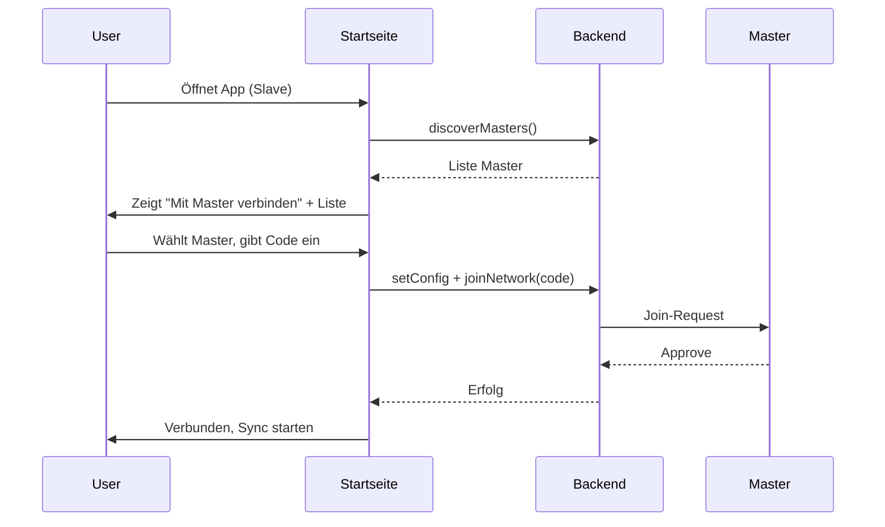

# Join vereinfachen (6-stelliger Code) + Slave-Infos auf Startseite

## Teil 1: Join-Token als 6-stelliger Code (3-3)

### Ziel

Statt UUID einen 6-stelligen Zifferncode (100000–999999) verwenden; Anzeige mit Leerzeichen (z.B. `123 456`), Eingabe mit Trennzeichen oder ohne.

### Backend (Rust)

**1. Token-Generierung** – [src-tauri/src/commands.rs](src-tauri/src/commands.rs)

- Abhängigkeit: In [src-tauri/Cargo.toml](src-tauri/Cargo.toml) `rand = "0.8"` hinzufügen (falls noch nicht vorhanden).
- In `generate_join_token`: Statt `uuid::Uuid::new_v4().to_string()` einen 6-stelligen Zufallscode erzeugen (`rand::thread_rng().gen_range(100_000..1_000_000)`), als 6-Ziffern-String formatieren (`format!("{:06}", code)`), in Config speichern und zurückgeben.

**2. Token-Prüfung beim Join** – [src-tauri/src/sync/server.rs](src-tauri/src/sync/server.rs)

- Beim Empfang der Join-Anfrage den übergebenen `token` normalisieren: alle Zeichen entfernen, die keine Ziffer sind; nur dann prüfen, ob die Länge genau 6 ist.
- Vergleich: `expected_token` aus DB (bereits 6 Ziffern) mit dem normalisierten Token-String. Bei Ungleichheit oder ungültiger Länge weiterhin „Ungültiger Join-Token“ zurückgeben.

### Frontend

**3. Master: Anzeige** – [src/components/EinstellungenView.tsx](src/components/EinstellungenView.tsx)

- Join-Token nur anzeigen, wenn `joinToken?.length === 6`; Darstellung als `joinToken.slice(0,3) + " " + joinToken.slice(3)` (z.B. `123 456`). Sonst unverändert oder „–“.

**4. Slave: Eingabe** – [src/components/EinstellungenView.tsx](src/components/EinstellungenView.tsx)

- Beim Absenden (`handleJoinNetwork`): aus `joinTokenInput` alle Nicht-Ziffern entfernen; wenn die Länge danach nicht 6 ist, Fehlermeldung „Bitte 6-stelligen Code eingeben“ und Request nicht senden.
- Optional: Platzhalter `000 000`; bei Eingabe automatische Formatierung (z.B. Leerzeichen nach 3 Ziffern) für bessere Lesbarkeit.

---

## Teil 2: Slave – Infos direkt auf der Startseite

### Ziel

Wenn eine Slave-Kasse die App öffnet, werden verfügbare Master automatisch ermittelt und auf der Startseite angezeigt. Der Nutzer kann einen Master wählen und mit dem 6-stelligen Join-Code beitreten, ohne ins Einstellungsmenü zu wechseln.

### Ablauf (konzeptionell)

### Implementierung

**5. Startseite: Discovery bei Slave** – [src/components/Startseite.tsx](src/components/Startseite.tsx)

- Wenn `role === "slave"`: Beim Mount (oder sobald `role` gesetzt ist) automatisch `discoverMasters(5)` aufrufen (z.B. einmalig mit kurzer Verzögerung, um Flackern zu vermeiden).
- State: `discoveredMasters: DiscoveredMaster[]`, `discoveryLoading: boolean`.
- Keinen eigenen „Master im Netzwerk suchen“-Button auf der Startseite nötig; die Suche läuft automatisch. Optional: „Erneut suchen“-Button.

**6. Startseite: Bereich „Mit Master verbinden“ (nur Slave)** – [src/components/Startseite.tsx](src/components/Startseite.tsx)

- Nur anzeigen, wenn `role === "slave"`.
- Wenn `discoveryLoading`: kurzer Hinweis „Suche Master…“.
- Wenn `discoveredMasters.length > 0`: Liste der gefundenen Master (Name, ggf. URL gekürzt); pro Eintrag Button „Beitreten“ (oder Klick auf Zeile).
- Bei Klick auf „Beitreten“ für einen Master: `master_ws_url` in Config setzen (z.B. `setConfig("master_ws_url", m.ws_url)`), dann ein **Join-Dialog** öffnen (siehe unten).
- Wenn keine Master gefunden: Hinweis „Keine Master gefunden. In Einstellungen URL eintragen oder später erneut suchen.“

**7. Join-Dialog auf der Startseite** – [src/components/Startseite.tsx](src/components/Startseite.tsx) oder eigene Komponente

- Wird geöffnet, wenn der Nutzer auf der Startseite bei einem Slave „Beitreten“ zu einem Master wählt (Master-URL ist dann bereits gesetzt).
- Inhalt:
  - **Join-Code:** ein Eingabefeld für 6 Ziffern (Anzeige/Formatierung 3-3 optional); Normalisierung vor dem Senden (nur Ziffern, Länge 6 prüfen).
  - **Eigene Sync-URL:** ein Feld (z.B. Platzhalter `ws://127.0.0.1:8766` oder aktueller Wert aus Config); Default „gleicher Rechner“ (127.0.0.1:8766) ist sinnvoll, wenn Master und Slave auf einer Maschine laufen.
- Aktionen: „Beitreten“ (setConfig für `my_ws_url`, dann `joinNetwork(normalizedCode)`, bei Erfolg Dialog schließen und ggf. `startSyncConnections()` aufrufen), „Abbrechen“ (Dialog schließen).
- Fehlermeldungen (ungültiger Code, fehlende Sync-URL, Netzwerkfehler) im Dialog anzeigen.

**8. Verhalten bei bereits verbundener Slave**

- Wenn die Slave-Kasse bereits verbunden ist (z.B. `syncSummary?.connected > 0`), kann der Bereich „Mit Master verbinden“ reduziert angezeigt werden (z.B. nur „Master gefunden: Name“ ohne großen Fokus) oder mit „Erneut suchen / anderen Master wählen“. Priorität: klare Anzeige des Verbindungsstatus (bereits vorhanden), darunter optional die Discovery-Liste.

### Betroffene Dateien (Teil 2)

- [src/components/Startseite.tsx](src/components/Startseite.tsx): Role-Logik, Discovery-aufruf, neuer Abschnitt „Mit Master verbinden“, Join-Dialog-State und -UI.
- [src/db.ts](src/db.ts): Bereits `discoverMasters`, `setConfig`, `joinNetwork` vorhanden – keine Signaturänderung nötig.
- Optional: Eigene Komponente `JoinDialog.tsx` für Code + Sync-URL und Join-Logik, von der Startseite aus eingebunden (bessere Wiederverwendbarkeit und übersichtlicheres Startseite-Markup).

### Reihenfolge

1. Teil 1 vollständig umsetzen (6-stelliger Token Backend + Frontend Einstellungen).
2. Danach Teil 2: Discovery auf der Startseite bei Slave, Bereich „Mit Master verbinden“, Join-Dialog mit 6-stelligem Code und eigener Sync-URL.

### Umsetzung (abgeschlossen)

- **Teil 1:** [commands.rs](src-tauri/src/commands.rs) erzeugt 6-stelligen Code (`gen_range(100_000..1_000_000)`, `format!("{:06}", code)`). [EinstellungenView](src/components/EinstellungenView.tsx): Anzeige `joinToken.slice(0,3)+" "+slice(3)`, Validierung „Bitte 6-stelligen Code eingeben“. Token-Prüfung im Server nutzt normalisierten Token.
- **Teil 2:** [Startseite.tsx](src/components/Startseite.tsx): Bei Slave Discovery beim Mount (wenn nicht verbunden), Bereich „Mit Hauptkasse verbinden“ mit Liste gefundener Master, Button „Beitreten“ öffnet Join-Dialog (`setJoinDialogMaster`), Dialog mit 6-stelligem Code und Sync-URL.

