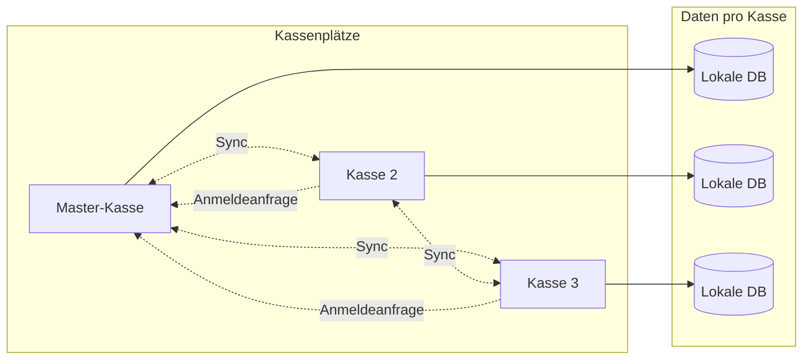

# Technische Optionen: Dezentrales Kassensystem mit Mehrkassen-Sync

## Anforderungen (Kurzfassung)

| Anforderung                                      | Implikation                                                                        |
| ------------------------------------------------ | ---------------------------------------------------------------------------------- |
| Mehrere Laptop-Kassen                            | Desktop-App (offline-fähig), lokale Persistenz pro Kasse                           |
| Produkte verschiedener Händler gemischt          | Jede Buchung trägt Händlernummer + Preis; Abrechnung = Aggregation pro Händler     |
| Kein zentraler Server / kein Internet garantiert | Sync nur zwischen Kassen (P2P oder LAN); keine Cloud-Pflicht                       |
| Unterbrechungen / später synchronisieren         | Offline-First, Sync-Queue, Merge bei Wiederverbindung                              |
| Dezentrale Sicherung durch Sync                  | Peers tauschen Daten untereinander aus; Redundanz auf mehreren Kassen              |
| Pro Buchung: erfassende Kasse                    | Jede Buchung speichert immer, welche Kasse gebucht hat (Kassen-ID)                 |
| Master-Kasse                                     | Eine Kasse setzt das System initial auf und genehmigt Anmeldeanfragen ans P2P-Netz |

---

## Architektur-Übersicht

- **Lokal**: Jede Kasse speichert alle Buchungen in einer lokalen Datenbank (und nach Sync auch die von anderen Kassen). **Jede Buchung enthält immer die Kassen-ID der erfassenden Kasse** – so ist nachvollziehbar, welche Kasse gebucht hat.
- **Master-Kasse**: Eine Kasse fungiert als **Master**: Sie setzt das System initial auf (z. B. erste Konfiguration, Netzwerk-Identität) und ist die Stelle, die **Anmeldeanfragen** neuer Kassen ans P2P-Netz **freigibt** (Join-Requests). Danach syncen alle Kassen untereinander wie gewohnt.
- **Sync**: Wenn Kassen im gleichen Netz erreichbar sind, tauschen sie neue/fehlende Buchungen aus. Neue Kassen müssen sich bei der Master-Kasse anmelden und werden nach Freigabe in den Sync-Verbund aufgenommen.
- **Abrechnung**: Aus der (lokal oder nach Sync) vollständigen Menge an Buchungen wird pro Händlernummer summiert; pro Buchung ist die erfassende Kasse über die Kassen-ID bekannt.

---

## Datenmodell (konzeptionell)

- **Buchung**: eindeutige ID (z. B. UUID), **Kassen-ID** (welche Kasse gebucht hat – Pflichtfeld), Händlernummer, Betrag, Zeitstempel, optional Artikel/Preisschild-Info. Die erfassende Kasse ist damit immer nachvollziehbar.
- **Kasse**: feste Kassen-ID pro Gerät, Name/Standort optional; eine Kasse ist als **Master** markiert (Initial-Setup, Freigabe von Anmeldeanfragen).
- **Sync-Metadaten**: u. a. welche Buchungen bereits an welchen Peer übertragen wurden (oder Vector Clocks / Sequence Numbers pro Kasse); bei Anmelde-Flow: ausstehende/geprüfte Join-Requests.

Wichtig: Buchungen werden **nur angelegt**, nicht von mehreren Kassen gleichzeitig bearbeitet. Dadurch entstehen **keine Schreibkonflikte** im klassischen Sinne – nur „neue“ Events müssen zusammengeführt werden. Das vereinfacht Sync erheblich (append-only Event-Stream pro Kasse).

---

## Sync-Strategien (ohne zentralen Server)

### 1. Append-only Event-Log (empfohlen für den Einstieg)

- Jede Kasse speichert Buchungen als **ereignisorientierte Einträge** mit global eindeutiger ID.
- **Sync-Protokoll**: Peers tauschen Listen von Buchungs-IDs bzw. Ranges aus; fehlende Buchungen werden nachgezogen.
- **Merge**: Neue Buchungen anderer Kassen werden einfach eingefügt (kein CRDT nötig). Duplikate werden über die eindeutige ID erkannt.
- **Vorteile**: Einfach zu verstehen und zu implementieren, deterministisch, gut testbar.
- **Nachteile**: Stornierungen/Korrekturen müssen als eigene Events modelliert werden (z. B. „Storno“ mit Referenz auf Original-Buchung).

### 2. CRDT-basierter Sync

- **Einsatz**: Sinnvoll, wenn es neben Buchungen auch geteilte Stammdaten (z. B. Produktlisten) mit gleichzeitigen Änderungen gibt.
- **Idee**: Konkurrierende Änderungen werden durch CRDT-Merges automatisch zusammengeführt (z. B. Automerge, Yjs, oder spezialisierte Strukturen).
- **Vorteile**: Konfliktfreie Zusammenführung auch bei gleichzeitigen Schreibzugriffen.
- **Nachteile**: Höherer Implementierungs- und Bibliotheksaufwand; für reine Buchungs-Streams oft overkill.

### 3. Event Sourcing + Replicated Log

- Alle Änderungen sind **Events** (z. B. „Buchung erstellt“, „Storno“). Jede Kasse hat einen lokalen Event-Store.
- Sync = Austausch von Events (z. B. nach Kassen-ID + Sequence Number). Alle Peers wenden dieselben Events an und kommen zum gleichen Zustand (eventual consistency).
- Passt gut zu Option 1; „Event Sourcing“ betont die saubere Trennung von Ereignis und Abrechnungs-Aggregation.

---

## Technologie-Optionen im Überblick

### Option A: Eigenes Sync auf Basis SQLite + Tauri/Electron (sehr kontrollierbar)

- **Stack**: Tauri (oder Electron) + SQLite (z. B. über [Tauri SQL Plugin](https://v2.tauri.app/plugin/sql/) oder `tauri-plugin-sql`) für die Kassen-App.
- **Sync**: Eigenes Protokoll über **WebSockets** oder **WebRTC** zwischen den Kassen:
  - **Discovery / Anmeldung**: Die **Master-Kasse** ist der bekannte Anlaufpunkt: Neue Kassen verbinden sich zuerst zur Master-Kasse, senden eine Anmeldeanfrage und erhalten nach Freigabe die Peer-Liste (bzw. werden in den Verbund aufgenommen). Alternativ zusätzlich mDNS im LAN.
  - **Ablauf**: Verbindung zwischen zwei Kassen → Austausch von „letzter bekannter“ Sequence/Version pro Kasse → Übertragung fehlender Buchungen (append-only).
- **Vorteile**: Volle Kontrolle, keine Abhängigkeit von Drittanbietern, eine Codebasis für UI + Logik + Sync, SQLite überall gut unterstützt.
- **Nachteile**: Sie müssen Sync-Logik, Duplikaterkennung und ggf. Konvergenz selbst implementieren und testen.

### Option B: RxDB + WebRTC P2P (fertige P2P-Sync-Engine)

- **Stack**: RxDB (lokale NoSQL-DB mit Reaktivität) + WebRTC-P2P-Replication; Frontend in React/Vue/etc., Verpackung z. B. mit Electron oder Tauri (WebView).
- **Sync**: [RxDB WebRTC Replication](https://rxdb.info/replication-webrtc.html) – Peers synchronisieren direkt; es wird **kein** zentraler Datenserver benötigt. Der **Signaling-Server** für die erste Verbindung (Offer/Answer) kann auf der **Master-Kasse** laufen; sie ist dann der feste Anlaufpunkt für Anmeldung und Peer-Vermittlung.
- **Vorteile**: Reife, dokumentierte P2P-Sync-Lösung, reaktiv, offline-first.
- **Nachteile**: NoSQL (wenn Sie stark SQL-getrieben denken), Abhängigkeit von RxDB/WebRTC; Signaling muss irgendwo laufen (z. B. lokal).

### Option C: OrbitDB + IPFS/libp2p (maximal dezentral)

- **Stack**: OrbitDB (CRDT-basiert) auf IPFS/libp2p; App z. B. Electron/Node.
- **Sync**: Serverlose P2P-Datenbank; Peers finden sich über libp2p und teilen Logs (z. B. für Buchungen als append-only Log).
- **Vorteile**: Kein zentraler Punkt, gut für verteilte/robuste Systeme.
- **Nachteile**: Schwererer Stack (IPFS/OrbitDB), weniger typisch für klassische Kassensysteme, Overhead für Ihr Szenario möglicherweise hoch.

### Option D: PowerSync / Replicache (nur wenn später doch ein Server okay ist)

- **PowerSync**: Verbindet lokales SQLite mit einem **Backend** (z. B. Postgres). Eher für „offline-first mit zentralem Backend“.
- **Replicache**: Ähnlich, Sync über Server; Projekt in Wartung.
- **Einsatz**: Nur sinnvoll, wenn Sie langfristig einen zentralen Server (z. B. für Abrechnung oder Backup) einplanen. Erfüllt **nicht** die Anforderung „ohne zentralen Server“.

---

## Empfehlung

- **Wenn Sie maximale Unabhängigkeit und klare Kontrolle wollen**: **Option A** (Tauri + SQLite + eigenes append-only Sync über WebSockets/WebRTC im LAN, Discovery per mDNS oder kleinem lokalen Discovery-Dienst). Geringste Abhängigkeiten, gut an Ihr Domänenmodell (Buchungen mit Händlernummer) anpassbar.
- **Wenn Sie schnell eine funktionierende P2P-Sync-Engine nutzen wollen**: **Option B** (RxDB + WebRTC), mit einem minimalen Signaling-Service im LAN (z. B. auf einem der Laptops), der nur zur Peer-Vermittlung dient – keine Kundendaten auf dem „Server“.

---

## Master-Kasse (Rolle und Ablauf)

- **Initial-Setup**: Nur die Master-Kasse führt das erste Einrichten durch (z. B. Netzwerk-/Sync-Parameter, erste Kassen-ID = Master). Weitere Kassen werden erst nach Freigabe hinzugefügt.
- **Anmeldeanfragen**: Eine neue Kasse (oder eine wieder eintretende) sendet eine **Anmeldeanfrage** (Join-Request) an die Master-Kasse. Die Master-Kasse entscheidet, ob die Kasse ins P2P-Netz aufgenommen wird (z. B. Bestätigung in der UI), und teilt bei Freigabe die nötigen Infos (Peer-Liste, ggf. initiale Datenbasis) mit.
- **Nach der Freigabe**: Die neue Kasse ist Teil des Sync-Verbunds und tauscht Buchungen mit allen anderen (inkl. Master) aus. Die Master-Kasse ist nur für Join/Leave-Logik „besonders“, nicht für den laufenden Datenaustausch zwingend im Weg.

Damit bleibt das System ohne zentralen Server, aber mit einer klaren Kontrollstelle für den Zutritt zum Netz.

---

## Wichtige Implementierungsdetails (unabhängig von der Option)

1. **Eindeutige Buchungs-IDs**: Pro Buchung eine UUID (oder Kassen-ID + monotone Sequenz), damit beim Merge keine Duplikate entstehen.
2. **Kassen-ID in jeder Buchung**: Jeder Kassenplatz hat eine feste ID; **jede Buchung trägt die Kassen-ID der Kasse, die die Buchung erfasst hat** – so ist immer erkennbar, welche Kasse gebucht hat.
3. **Master-Kasse**: Beim Setup wird eine Kasse als Master bestimmt; sie verwaltet Anmeldeanfragen und gibt neue Kassen frei. Die Master-Rolle kann in Konfiguration oder in der gemeinsamen Netzwerk-„Topologie“ (z. B. bekannter Master-Endpunkt) hinterlegt sein.
4. **Sync-Queue**: Wenn keine Verbindung besteht, Änderungen lokal halten und beim nächsten erreichbaren Peer synchronisieren (inkl. Retry-Logik).
5. **Abrechnung**: Abfrage über alle Buchungen (lokal gespeichert), Gruppierung nach `Händlernummer`, Summe `Betrag`; optional Filter/Aufschlüsselung nach `Kassen-ID` (welche Kasse wie viel gebucht hat). Kann auf jeder Kasse laufen, die bereits mit anderen synchronisiert wurde.
6. **Signaling (bei WebRTC)**: Im reinen LAN reicht ein einfacher WebSocket-Server auf einem Gerät (idealerweise die Master-Kasse als bekannter Anlaufpunkt); ICE-Server können leer bleiben. Kein Internet nötig.

---

## Nächste Schritte (nach Auswahl)

- Konkrete Datenstrukturen (Tabellen/Schema) und API für Buchung erfassen + Abfragen festlegen.
- Discovery- und Pairing-Flow definieren: neue Kasse findet Master-Kasse, sendet Anmeldeanfrage, Master gibt frei; danach Sync mit allen Peers.
- Sync-Protokoll spezifizieren (Nachrichtenformat, Reihenfolge, Duplikaterkennung).
- Einen Prototyp einer Kasse (nur lokale Erfassung + Abrechnungsansicht) bauen, danach Sync für 2 Knoten ergänzen.

Wenn Sie sich für eine Option (A oder B) entscheiden, kann im nächsten Schritt ein detaillierter Implementierungsplan (Dateistruktur, konkrete Bibliotheken, Beispiel-Schema) erstellt werden.