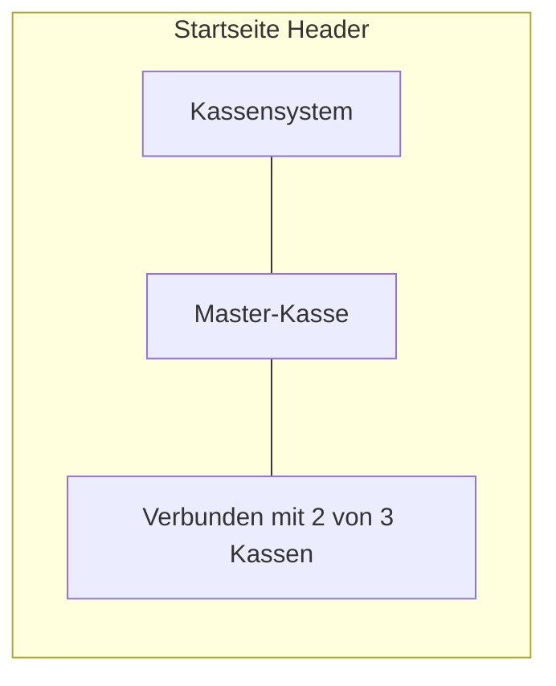

# Master-Discovery + Rollen- und Verbindungsanzeige

## 1. Anmelden vereinfachen (Master im Netzwerk finden)

**Ziel:** Slave-Kassen finden die Master-Kasse im LAN per mDNS und können sie aus einer Liste wählen; manuelle URL-Eingabe bleibt Fallback.

- **Backend (Rust):** Neues Modul `discovery.rs` mit Crate `mdns-sd`. Master registriert beim Start des WebSocket-Servers einen Dienst `_kassensystem-master._tcp.local` (Port aus Config). Slaves rufen Command `discover_masters()` auf (Browse mit Timeout), Rückgabe: Liste `{ name, host, port, ws_url }`.
- **Frontend:** In den Einstellungen (Slave-Bereich) Button „Master im Netzwerk suchen“, gefundene Master anzeigen, bei Klick `master_ws_url` setzen. Bestehendes Textfeld Master-URL bleibt für manuelle Eingabe.

Betroffene Dateien: `src-tauri/Cargo.toml`, `src-tauri/src/discovery.rs`, `src-tauri/src/lib.rs`, `src-tauri/src/commands.rs`, `src/db.ts`, `src/components/EinstellungenView.tsx`.

---

## 2. Rolle auf einen Blick: Master vs. Slave

**Anforderung:** Auf der Master-Kasse soll klar angezeigt sein, dass dies die Master-Kasse ist; bei Slaves ebenso, dass es eine Slave-Kasse ist.

**Umsetzung:**

- **Ort:** Startseite ist die zentrale Ansicht nach dem Start; die Rolle soll dort sofort sichtbar sein (nicht nur in den Einstellungen).
- **Master:** Im Header der Startseite ([src/components/Startseite.tsx](src/components/Startseite.tsx)) unter oder neben „Kassensystem“ einen sichtbaren Hinweis anzeigen, z. B. **„Master-Kasse“** (Badge oder Untertitel).
- **Slave:** Ebenfalls im Header **„Slave-Kasse“** anzeigen. Optional: falls die Master-Kasse einen Anzeigenamen hat (z. B. aus Peer-Liste/Config), „Verbunden mit Master: Stand 1“ anzeigen – dazu müsste die Master-Kasse in der Peer-Liste als solche erkennbar sein (z. B. `config` oder erste Kasse mit `is_master=1`); sonst reicht „Slave-Kasse“.

**Technik:** Bereits vorhanden: `getConfig("role")` liefert `"master"` oder `"slave"`. Startseite lädt Rolle (wie bisher für die Tiles) und zeigt sie im Header an. Kein neues Backend nötig.

```mermaid
flowchart LR
  subgraph start [Startseite]
    H["Kassensystem"]
    R["Master-Kasse" oder "Slave-Kasse"]
    H --> R
  end
```

---

## 3. Verbindungsstatus auf einen Blick

**Anforderung:** Es soll auf einen Blick ersichtlich sein, ob die Verbindung (zu den anderen Kassen) aktiv ist oder nicht.

**Ist-Zustand:** Der detaillierte Sync-Status (pro Peer „Verbunden“/„Getrennt“, letzter Sync) existiert bereits in [SyncStatusView](src/components/SyncStatusView.tsx) und nutzt `get_sync_status()`. Die Nutzer müssen aber gezielt „Sync-Status“ öffnen.

**Soll:**

- **Kompakte Anzeige auf der Startseite** (oder in einer dauerhaft sichtbaren Leiste), z. B.:
  - **„Verbunden mit 2 von 3 Kassen“** (grün/positiv), wenn mindestens eine Verbindung aktiv ist.
  - **„Nicht verbunden“** oder **„0 von 3 Kassen verbunden“** (deutlich hervorgehoben, z. B. rot/warnend), wenn keine Verbindung aktiv ist.
  - Wenn **keine Peers** konfiguriert sind (z. B. Master ohne Slaves, oder Slave noch nicht gejoint): **„Keine Peers“** oder die Anzeige ausblenden/neutral halten.
- **Visuell:** Kurzer Text + klare Kennzeichnung (Farbe und/oder Icon), z. B. grüner Punkt / „Verbunden“ vs. roter Punkt / „Getrennt“.

**Technik:**

- **Backend:** Es reicht die bestehende API `get_sync_status()`: liefert `SyncStatusEntry[]` mit `connected` pro Peer. Daraus im Frontend ableiten: `total = entries.length`, `connected = entries.filter(e => e.connected).length`.
- **Optional:** Neues Command `get_connection_summary()` mit Rückgabe `{ role, total_peers, connected_count }`, um nur eine Zahl zu übertragen und die Startseite ohne volle Peer-Liste zu halten. Kann in einer ersten Version entfallen; dann Startseite ruft `getSyncStatus()` auf (ggf. mit etwas Throttling/Interval wie in SyncStatusView).
- **Frontend:** Startseite lädt Sync-Status (einmal beim Mount + optional alle paar Sekunden), zeigt eine Zeile unter der Rollen-Anzeige: „Verbunden mit X von Y Kassen“ bzw. „Nicht verbunden“ mit entsprechender CSS-Klasse (z. B. `.connection-ok` / `.connection-warn`).

**Platzierung:** Direkt unter dem Titel/Rollen-Badge auf der Startseite; oder als kleine Statuszeile oben. Sync-Status-Tile bleibt für die detaillierte Ansicht erhalten.



---

## 4. Zusammenfassung der Änderungen

| Bereich | Änderung |
|--------|----------|
| **Discovery** | mDNS-Modul, Master registriert sich, Slaves browsen; Einstellungen: „Master suchen“, Liste, Auswahl setzt Master-URL. |
| **Rollen-Anzeige** | Startseite: Header zeigt „Master-Kasse“ oder „Slave-Kasse“ (evtl. Slave + „Verbunden mit Master: …“). |
| **Verbindungsstatus** | Startseite: kompakte Zeile „Verbunden mit X von Y Kassen“ / „Nicht verbunden“ mit visueller Hervorhebung (grün/rot); Daten aus `get_sync_status()`. |

---

## 5. Betroffene Dateien (Gesamtüberblick)

- **Rust:** `src-tauri/Cargo.toml`, `src-tauri/src/discovery.rs`, `src-tauri/src/lib.rs`, `src-tauri/src/commands.rs`
- **Frontend:** `src/db.ts`, `src/components/EinstellungenView.tsx`, `src/components/Startseite.tsx` (Rolle + Verbindungsstatus), ggf. `src/components/Startseite.css`

Optional später: `get_connection_summary` in `commands.rs` + `db.ts`, wenn die Startseite ohne volle Peer-Liste auskommen soll.
