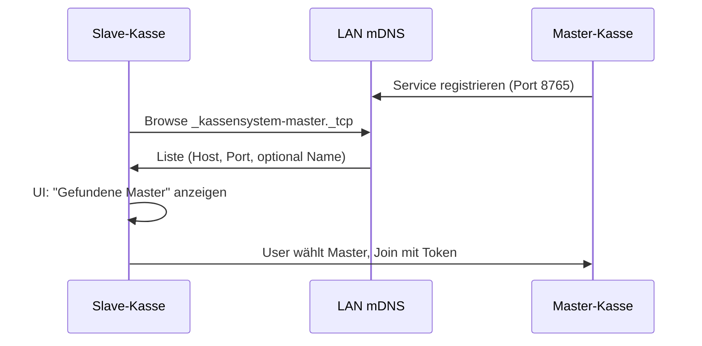

# Anmelden vereinfachen: Master im Netzwerk finden

## Ausgangslage

- **Aktuell:** Slave-Kassen müssen die Master-URL (z. B. `ws://192.168.1.10:8765`) und die eigene Sync-URL manuell in den Einstellungen eintragen, dazu den Join-Token von der Master-Kasse.
- **Ziel:** Ist eine Master-Kasse im gleichen Netzwerk, soll sie von den Slaves **automatisch gefunden** und in einer Liste **angeboten** werden; Nutzer wählt den gewünschten Master aus und gibt nur noch den Join-Token ein (manuelle URL-Eingabe bleibt als Fallback erhalten).

## Technischer Ansatz: mDNS (DNS-SD)

- **Master** meldet sich im LAN per mDNS als Dienst vom Typ `_kassensystem-master._tcp.local` an (mit dem bereits genutzten WebSocket-Port, z. B. 8765).
- **Slaves** durchsuchen das Netzwerk nach diesem Diensttyp und erhalten Host und Port; daraus wird die WebSocket-URL `ws://<host>:<port>` gebaut.
- Vorteile: kein zusätzlicher Port, gängiges Verfahren (Drucker, Smart Home), plattformübergreifend. Rust-Crate: [mdns-sd](https://crates.io/crates/mdns-sd) (browse + register, async-kompatibel).

## Implementierung

### 1. Backend: Discovery-Modul (Rust)

- **Neue Datei:** [src-tauri/src/discovery.rs](src-tauri/src/discovery.rs)
  - **Master:** Beim Start des WebSocket-Servers (z. B. in `commands.rs` / wo `start_master_server` den Server startet) mDNS-Service registrieren: Typ `_kassensystem-master._tcp.local`, Port aus Config (`ws_server_port`), optionaler Dienstname z. B. aus `kassenname`. Beim Beenden der App bzw. beim Stoppen des Servers Service wieder abmelden (goodbye).
  - **Slave:** Öffentliche Funktion/Command `discover_masters()`: Browse nach `_kassensystem-master._tcp.local` mit Timeout (z. B. 3–5 Sekunden), Rückgabe als Liste von `{ name: string, host: string, port: u16, ws_url: string }` (ws_url = `ws://host:port`). Duplikate nach (host, port) vermeiden.
- **Cargo.toml:** Abhängigkeit `mdns-sd` hinzufügen.
- **lib.rs:** Modul `discovery` einbinden; neuen Tauri-Command `discover_masters` registrieren (nur aufrufbar wenn Rolle Slave oder noch nicht eingerichtet; bei Bedarf Rolle prüfen oder immer erlauben).

### 2. Frontend: Einstellungen (Slave) und ggf. Erststart

- **[src/components/EinstellungenView.tsx](src/components/EinstellungenView.tsx)** (Slave-Bereich „Netz beitreten“):
  - State: `discoveredMasters: Array<{ name, ws_url }>` und `discoveryLoading: boolean`.
  - Button **„Master im Netzwerk suchen“**: ruft `discover_masters()` auf (neuer Invoke in [src/db.ts](src/db.ts)), setzt `discoveredMasters` mit der Rückgabe, zeigt Ladezustand während der Suche.
  - Darunter: Wenn `discoveredMasters.length > 0`, Liste der gefundenen Master anzeigen (z. B. Name + URL); Klick auf einen Eintrag setzt `master_ws_url` auf die zugehörige `ws_url` und speichert in Config.
  - Bestehendes Textfeld „Master-URL“ bleibt darunter als **manuelle Eingabe** erhalten (Fallback).
  - Keine Änderung am Ablauf „Join-Token eingeben“ und „Netz beitreten“ – die Logik in `handleJoinNetwork` bleibt gleich; sie nutzt weiterhin `master_ws_url` aus dem State (der jetzt auch per Discovery gesetzt werden kann).
- **Optional / später:** Im [ErststartDialog](src/components/ErststartDialog.tsx) beim Schritt „Netz beitreten (Slave-Kasse)“ nach Abschluss der Einrichtung (setupSlave) auf Einstellungen verweisen oder dort einen Hinweis „Master im Netzwerk suchen“ anzeigen, damit Nutzer direkt zur Discovery geführt werden. Kann in einer ersten Version entfallen und nur Einstellungen erweitert werden.

### 3. Konfiguration und Abhängigkeiten

- **Config:** Es wird keine neue Config-Variable zwingend benötigt; der Master-Port und -Name kommen aus bestehenden Keys (`ws_server_port`, `kassenname`). Optional: Dienstname für mDNS aus `kassenname` oder feste Bezeichnung „Kassensystem Master“.
- **Netzwerk/Firewall:** mDNS nutzt UDP 5353 (Multicast); in typischen Heim-/Büro-Netzen meist erlaubt. Kein zweiter Port für die App nötig.

### 4. Randfälle

- **Mehrere Master im LAN:** Alle anzeigen; Nutzer wählt die richtige Kasse (Name/URL unterscheidbar).
- **Kein Master gefunden:** Klare Meldung „Keine Master-Kasse gefunden. Bitte URL manuell eintragen.“ und weiterhin das Textfeld anzeigen.
- **Master startet nach Slave:** Nutzer kann erneut „Master im Netzwerk suchen“ klicken.

## Betroffene Dateien (Überblick)

| Bereich  | Datei                                  | Änderung                                                                                                          |
| -------- | -------------------------------------- | ----------------------------------------------------------------------------------------------------------------- |
| Rust     | `src-tauri/Cargo.toml`                 | Dependency `mdns-sd`                                                                                              |
| Rust     | `src-tauri/src/discovery.rs`           | Neu: Register (Master), Browse (Slave), Bau von ws_url                                                            |
| Rust     | `src-tauri/src/lib.rs`                 | Modul + Command `discover_masters`                                                                                |
| Rust     | `src-tauri/src/commands.rs`            | Beim Start des Master-WebSocket-Servers Discovery-Registrierung aufrufen; ggf. beim App-Exit/Server-Stop abmelden |
| Frontend | `src/db.ts`                            | Neue Funktion `discoverMasters(): Promise<DiscoveredMaster[]>` (invoke)                                           |
| Frontend | `src/components/EinstellungenView.tsx` | Button „Master im Netzwerk suchen“, Liste gefundener Master, Übernahme in master_ws_url                           |

## Reihenfolge der Umsetzung

1. **Discovery-Modul (Rust):** `discovery.rs` anlegen, `discover_masters` Command, mDNS Browse mit Timeout; in `lib.rs` und `commands.rs` einbinden.
2. **Master-Registrierung:** Beim Start des WebSocket-Servers (Master) mDNS-Service registrieren; beim Beenden abmelden (soweit steuerbar).
3. **Frontend:** `discoverMasters` in `db.ts`, dann EinstellungenView um Suche und Auswahlliste erweitern.
4. **Optional:** Erststart-Dialog um Hinweis auf „Master suchen“ in den Einstellungen ergänzen.

Damit wird die Anmeldung vereinfacht: Slaves finden die Master-Kasse im Netzwerk und können sie auswählen; nur noch Join-Token und eigene Sync-URL sind nötig, die manuelle Master-URL bleibt Fallback.

### Umsetzung (abgeschlossen)

[discovery.rs](src-tauri/src/discovery.rs) mit mDNS Browse/Register, Command `discover_masters` in [lib.rs](src-tauri/src/lib.rs). Master registriert Service beim Start des WebSocket-Servers ([commands.rs](src-tauri/src/commands.rs)). [db.ts](src/db.ts) `discoverMasters()`. [EinstellungenView](src/components/EinstellungenView.tsx): Button „Hauptkasse im Netzwerk suchen“, Liste gefundener Master, Übernahme in master_ws_url. [Startseite](src/components/Startseite.tsx) bei Slave: automatische Discovery, Bereich „Mit Hauptkasse verbinden“ mit Liste und „Beitreten“. [SyncStatusView](src/components/SyncStatusView.tsx): Discovery-Sektion „Suchen“.