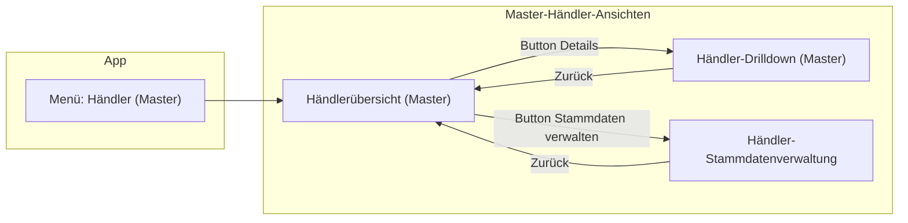

## Zielbild

- **Master-Händlerbereich trennen** in:
  - **Händlerübersicht (Master)**: read-only Liste aller Händler mit Umsätzen und Drilldown-Möglichkeit, funktional nah an `HaendlerSlaveView`, aber mit Master-spezifischen Aktionen.
  - **Stammdatenverwaltung**: eigene View/Fenster für Anlage/Bearbeitung/Import/Export von Händlerstammdaten (bisherige `HaendlerverwaltungView` weiterentwickeln).
- **UX-Konsistenz** zu den Slaves herstellen: expliziter „Details“-Button, eigener Drilldown-View, klare Zurück-Navigation, gleiche Formatierung der Beträge.
- **Master-spezifische Mehrwerte**: von der Übersicht aus bequem in die Stammdaten springen können, ohne die Übersicht zu „überladen“.

## Grobe Architekturidee

- **Neue Master-Views** (Namen beispielhaft):
  - `view === "haendler_master_uebersicht"`: Händlerliste mit Umsatzspalten und Drilldown-Buttons.
  - `view === "haendler_master_drilldown"`: Händler-Drilldown (ähnlich Slave-Drilldown, aber von der Master-Übersicht aus gestartet).
  - `view === "haendler_stammdaten"`: Stammdatenverwaltung (entspricht/ersetzt bisherige `HaendlerverwaltungView`), inklusive Import/Export.
- **Navigation** in `App.tsx`:
  - Menü-Eintrag "Händler (Master)" öffnet `haendler_master_uebersicht`.
  - Von dort Buttons:
    - "Stammdaten verwalten" → `setView("haendler_stammdaten")`.
    - Pro Händler: "Details" → `setView("haendler_master_drilldown")` mit Übergabe der Händler-ID/-Nummer.
  - Jede dieser Views hat einen **klaren Zurück-Button**:
    - Drilldown zurück zur Übersicht.
    - Stammdaten zurück zur Übersicht (oder zum vorherigen Kontext, falls anders definiert).

## Konkrete UI-Funktionen in der Master-Händlerübersicht

- **Spalten** (analog Slave + Master-Extras):
  - Händlernummer, Name/Anzeige-Name.
  - Summe Umsatz im aktuellen Zeitraum (aus Backend, z. B. `get_haendler_umsatz` oder eigenem Command).
  - Optional: Anzahl Buchungen, letzte Buchung.
  - Aktionen:
    - Button **„Details“** (öffnet Drilldown-View).
    - Button **„Stammdaten“** (öffnet Stammdaten-View vorgefüllt auf diesen Händler, optional).
- **Toolbar / Kopfbereich**:
  - Filter nach Zeitraum (z. B. heute, Zeitraum von/bis) – Wiederverwendung der Logik aus der Abrechnung, falls vorhanden.
  - Suchfeld nach Händlernummer/Name.
  - Globaler Button **„Stammdaten verwalten…“** (ohne Vorauswahl).

## Backend-/Datenanforderungen

- **Umsatz-Aggregation für Master-Übersicht**:
  - Wiederverwendung des bestehenden Commands zur Händlerumsatz-Berechnung, falls bereits vorhanden (`get_haendler_umsatz`).
  - Falls noch nicht passend: eigener Command z. B. `get_haendler_uebersicht` bzw. `get_haendler_umsatzliste`, der für einen Zeitraum **pro Händler** aggregiert:
    - Händlernummer, Name.
    - Summe Umsatz.
    - Optional Anzahl Buchungen, Datum der letzten Buchung, Aufteilung nach Kassen fürs Drilldown.
  - Frontend ruft nur diesen Command auf, **keine eigene SQL-/Summenlogik im TS** (Konformität zur bestehenden Regel).
- **Drilldown-Backend**:
  - Falls bereits für Slave-Drilldown vorhanden: Command zur Abfrage der Buchungen eines Händlers im Zeitraum.
  - Ggf. neuen Command `get_haendler_buchungen` standardisieren, sodass sowohl Master- als auch Slave-Drilldown denselben Pfad nutzen.

## Wiederverwendung von Slave-Komponenten

- **Komponenten-Extraktion**:
  - Bestehende `HaendlerSlaveView` in **generische Teile** und **Slave-spezifische Hülle** aufteilen:
    - Generische Komponenten wie `HaendlerListeMitUmsatz`, `HaendlerDrilldownView` (ohne Annahmen über Mutationen).
    - Slave-spezifische Einbettung, die diese Komponenten nur read-only nutzt.
  - Master-Übersicht und -Drilldown nutzen die gleichen generischen Komponenten, ggf. mit zusätzlichen Buttons (z. B. „Stammdaten bearbeiten“).
- **Styling/UX**:
  - Gleiche Tabellen-Styles, Farben und Betragsformatierung wie in der Abrechnung und Slave-Ansicht.
  - Einheitliche Darstellung der Beträge (immer zwei Nachkommastellen, `€`).

## Stammdatenverwaltung als eigene View/Fenster

- **Variante (empfohlen)**: **eigene View in `App.tsx`**
  - Bisherige `HaendlerverwaltungView` bleibt zentrale Komponente für Stammdaten (beziehungsweise wird dorthin verschoben), aber:
    - `view === "haendler_stammdaten"` in `App.tsx`.
    - Props: `onBack` (zurück zur `haendler_master_uebersicht`), optional `initialHaendlernummer` zum gezielten Öffnen eines Händlers.
  - Vorteile:
    - Einfachere Navigation.
    - Kein zusätzliches OS-Fenster.
    - Einfache Weiterentwicklung (Import/Export, Validierung etc. aus vorhandenem Plan "Händlerverwaltung erweitern").
- **Alternative**: separates Tauri-Fenster (nur falls du wirklich parallele Bearbeitung in zwei Fenstern brauchst).
  - Extra Aufwand (Fenster-Management, State-Sync, UX-Konsistenz), deshalb nur zweite Wahl.

## Konkrete Umsetzungsschritte (hochlevelig)

1. **Bestandsaufnahme Code**
  - `App.tsx` prüfen: aktuelle Händler-Views und Navigation.
  - `HaendlerSlaveView` und evtl. vorhandenen Händler-Drilldown sichten.
  - `HaendlerverwaltungView` (Master-Stammdaten) und vorhandene Commands in `src-tauri/src/commands.rs`/`src/db.ts` checken.
2. **Backend-Endpunkte klären/anlegen**
  - Prüfen, ob es bereits einen Command für Händlerumsatz-Aggregation gibt.
  - Falls nötig, neuen Command für Händlerübersicht + Drilldown definieren und in `db.ts` anbinden.
3. **Neue Master-Händler-Views definieren**
  - In `App.tsx` neue View-Typen `haendler_master_uebersicht`, `haendler_master_drilldown`, `haendler_stammdaten` hinzufügen.
  - Menü-Eintrag(en) so anpassen, dass von der Master-Kasse klar in diese Bereiche navigiert werden kann.
4. **UI-Komponenten auf Basis von Slave-Ansicht extrahieren**
  - Generische Komponenten für Händlerliste und Drilldown ableiten.
  - `HaendlerSlaveView` auf Nutzung dieser generischen Komponenten umstellen (ohne Funktionsänderung).
5. **Master-Händlerübersicht bauen**
  - Tabelle mit Händler + Umsatz + Aktionen implementieren.
  - Filter, Suche und Zeitraumsteuerung ergänzen.
  - Buttons für Drilldown und Stammdaten-Verwaltung verdrahten.
6. **Master-Drilldown implementieren**
  - Drilldown-View analog Slave (ggf. generische Komponente wiederverwenden).
  - Klare Überschrift mit Händlername/-nummer; gruppiert nach Kasse; Beträge formatiert.
  - Sichtbarer Zurück-Button zur Master-Übersicht.
7. **Stammdaten-View integrieren**
  - `HaendlerverwaltungView` als `haendler_stammdaten` in `App.tsx` einhängen.
  - Optional: Möglichkeit, direkt mit einem vorgewählten Händler zu starten (für „Stammdaten“-Button pro Zeile in der Übersicht).
8. **Tests & UX-Feinschliff**
  - Navigation einmal komplett durchklicken (Start → Master-Händlerübersicht → Drilldown → zurück; Start → Master-Händlerübersicht → Stammdaten → zurück).
  - Darstellung der Beträge und Summen gegen Abrechnung vergleichen.
  - Performance der Händlerübersicht mit realistischen Datenmengen prüfen.

