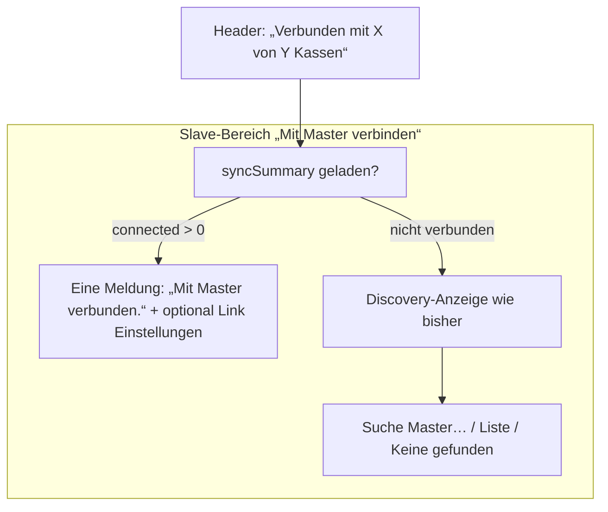

# Deutlichere visuelle Transparenz: Verbindungsstatus Slave-Kasse

## Problem

Auf der Startseite einer **Slave-Kasse** erscheinen widersprüchliche Meldungen:

- Oben (Header): **"Verbunden mit 1 von 1 Kassen"** (grün) – korrekt.
- Im Kasten **"Mit Master verbinden"**:
  - Zuerst kurz **"Suche Master…"** (weil beim Laden immer mDNS-Discovery gestartet wird).
  - Danach **"Keine Master gefunden. In Einstellungen URL eintragen…"** (weil Discovery oft nichts findet, z.B. bei bereits gespeicherter URL oder gleichem Rechner).
  - Zusätzlich **"Bereits verbunden mit Master – bei Bedarf in Einstellungen erneut suchen."** (grün).

Nutzer sehen also „Suche Master“ / „Keine Master gefunden“ und gleichzeitig „Bereits verbunden“ – das wirkt widersprüchlich und undurchsichtig.

**Ursache:** Zwei unabhängige Datenquellen werden nebeneinander angezeigt:

1. **Discovery** (mDNS): `discoveryLoading` / `discoveredMasters` – wird bei jedem Aufruf der Startseite für die Slave-Rolle ausgelöst ([Startseite.tsx](src/components/Startseite.tsx) Zeilen 70–79).
2. **Sync-Status** (`get_sync_status()`): `syncSummary.connected` – zeigt die reale Verbindung zu Peers/Master (Zeilen 124–132, 212–215).

Die UI mischt beide: Sie zeigt immer den Discovery-Zustand (Suche / Keine gefunden / Liste) und zusätzlich bei Verbindung den Hinweis „Bereits verbunden“.

---

## Ziel

- **Eine klare Aussage:** Ob die Kasse verbunden ist oder nicht, soll aus **einer** logischen Quelle und an **einer** Stelle im Bereich „Mit Master verbinden“ erkennbar sein.
- **Kein Widerspruch:** Wenn verbunden, soll nicht mehr „Suche Master“ oder „Keine Master gefunden“ im Vordergrund stehen.
- **Einfache Optik:** Verbunden = eine grüne, eindeutige Meldung; nicht verbunden = Suche/Liste/Handlungsanweisung wie bisher, aber ohne zusätzlichen „Bereits verbunden“-Text.

---

## Vorschlag (konkrete Änderungen)

### 1. Verbindungsstatus priorisieren (Slave-Bereich „Mit Master verbinden“)

**Datei:** [src/components/Startseite.tsx](src/components/Startseite.tsx)

- **Wenn Slave bereits verbunden** (`syncSummary && syncSummary.connected > 0`):
  - Im Abschnitt **"Mit Master verbinden"** **nicht** den Discovery-Zustand als Hauptinhalt anzeigen (kein „Suche Master…“, keine „Keine Master gefunden“-Zeile).
  - Stattdessen **eine** klare Meldung anzeigen, z.B.:
    - **"Mit Master verbunden."** (grün, gleicher Stil wie `.startseite-connection-ok` / `.startseite-join-connected`).
    - Optional darunter: Link oder Button **"In Einstellungen Master erneut suchen"** (führt zur Einstellungsseite oder öffnet Discovery on demand), damit Nutzer bei Bedarf wechseln können.
  - Damit entfällt die Doppelung „Keine Master gefunden“ + „Bereits verbunden“.
- **Wenn Slave nicht verbunden** (`!syncSummary || syncSummary.connected === 0`):
  - Bestehende Logik beibehalten: „Suche Master…“ / Liste der gefundenen Master / „Keine Master gefunden. In Einstellungen …“.
  - Den Zusatz „Bereits verbunden mit Master …“ hier nicht anzeigen (kommt nur bei verbunden vor).

### 2. Discovery beim Start optional dämpfen (Slave, bereits verbunden)

**Datei:** [src/components/Startseite.tsx](src/components/Startseite.tsx)

- Der `useEffect`, der bei `role === "slave"` die Discovery startet (Zeilen 70–79), kann so erweitert werden:
  - Discovery **nur starten**, wenn **nicht** bereits verbunden ist (z.B. erst nach dem ersten `syncSummary`-Lauf: `syncSummary === null || syncSummary.connected === 0`).
  - Oder: Discovery weiter im Hintergrund starten, aber die Anzeige im UI (wie unter 1.) davon entkoppeln – sobald `syncSummary.connected > 0`, wird nur noch „Mit Master verbunden“ angezeigt und kein „Suche Master“ / „Keine Master gefunden“ mehr.

Empfehlung: Zunächst nur die **Anzeige-Logik** (Punkt 1) umstellen; die Dämpfung der Discovery (Punkt 2) optional umsetzen, um beim ersten Laden kein kurzes „Suche Master“ mehr zu zeigen, wenn schon verbunden.

### 3. Visuelle Einheit: Kasten „Mit Master verbinden“

**Datei:** [src/components/Startseite.css](src/components/Startseite.css) (optional)

- Wenn verbunden: Kasten kann optisch als „alles in Ordnung“ hervorgehoben werden (z.B. grüner Rand oder dezentes Icon), analog zur grünen Header-Zeile.
- Wenn nicht verbunden: unverändert neutral (grau) oder leicht „Hinweis“-Stil, damit der Unterschied auf einen Blick erkennbar ist.

---

## Ablauf (vereinfacht)

- **Header** bleibt unverändert: „Verbunden mit X von Y Kassen“ (grün) bzw. „Nicht verbunden (0 von Y Kassen)“ (rot) – bereits eine klare Aussage.
- **Slave-Kasten** zeigt nur noch einen konsistenten Zustand: entweder „verbunden“ (eine Zeile) oder „nicht verbunden“ (Discovery-Status).

---

## Betroffene Dateien

| Datei                                                          | Änderung                                                                                                                                                                                                                                                                                    |
| -------------------------------------------------------------- | ------------------------------------------------------------------------------------------------------------------------------------------------------------------------------------------------------------------------------------------------------------------------------------------- |
| [src/components/Startseite.tsx](src/components/Startseite.tsx) | Slave-Abschnitt: Verzweigung nach `syncSummary.connected > 0`; bei verbunden nur eine grüne Meldung + optional „In Einstellungen erneut suchen“; bei nicht verbunden bestehende Discovery-Anzeige ohne „Bereits verbunden“. Optional: Discovery-useEffect nur starten wenn nicht verbunden. |
| [src/components/Startseite.css](src/components/Startseite.css) | Optional: Klasse für „verbunden“-Zustand des Kastens (z.B. grüner Rand), um Status auf einen Blick erkennbar zu machen.                                                                                                                                                                     |

---

## Keine Änderung

- **Master-Seite:** Header + „Angemeldete Kassen“ mit Verbunden/Getrennt-Badges bleiben wie sie sind.
- **SyncStatusView** und **Einstellungen** (Discovery-Button „Master im Netzwerk suchen“) bleiben unverändert; nur die Startseiten-Darstellung wird vereinheitlicht.

## Umsetzung (abgeschlossen)

In [Startseite.tsx](src/components/Startseite.tsx): Im Slave-Bereich „Mit Hauptkasse verbinden“ wird bei `slaveConnected` nur „Mit Hauptkasse verbunden.“ + Link „In Einstellungen Hauptkasse erneut suchen“ angezeigt; bei nicht verbunden die Discovery-Anzeige (Suche/Liste/Keine gefunden) ohne zusätzlichen „Bereits verbunden“-Text.

