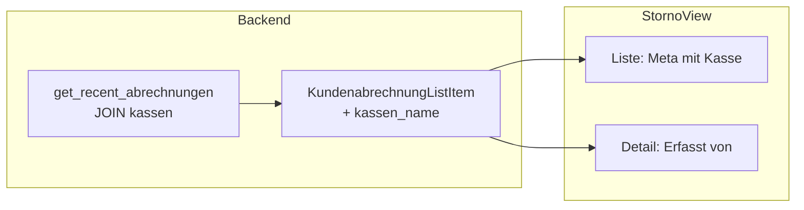

# Kassen-Information in der Storno-Ansicht

## Kontext

- Eine **Buchung** gehört zu einer **Kundenabrechnung**; die erfassende **Kasse** ist die der Abrechnung (`kundenabrechnung.kassen_id` → `kassen`). Alle Positionen einer Abrechnung stammen von derselben Kasse.
- Die Storno-Ansicht lädt bereits `getRecentAbrechnungen` (mit `kassen_id`) und `getBuchungenForAbrechnung`. Ein zusätzlicher Kassenname pro Abrechnung reicht aus; pro Buchung ist keine eigene Kassen-Info nötig.

## Vorgehen

### 1. Backend: Kassennamen in Abrechnungsliste

**Datei:** [src-tauri/src/commands.rs](src-tauri/src/commands.rs)

- **Struct** `KundenabrechnungListItem`: neues Feld `kassen_name: Option<String>` (nach `kassen_id`).
- **Query** in `get_recent_abrechnungen`:  
  - `LEFT JOIN kassen k ON ka.kassen_id = k.id`  
  - SELECT um `k.name AS kassen_name` ergänzen (Index 6).  
  - Im `query_map` die neue Spalte auslesen und ins Struct übernehmen.

Damit liefert die bestehende API den Anzeigenamen der Kasse ohne weitere Frontend-Requests.

### 2. Frontend: Typ und Anzeige

**Datei:** [src/db.ts](src/db.ts)

- Typ `KundenabrechnungListItem` um `kassen_name: string | null` erweitern.

**Datei:** [src/components/StornoView.tsx](src/components/StornoView.tsx)

- **Linke Liste (Abrechnungen):** In `.storno-abrechnung-meta` die Kasse anzeigen, z. B.  
`{formatDatum(a.zeitstempel)} · {a.anzahl_positionen} Pos. · Kasse: {a.kassen_name ?? a.kassen_id}`  
(oder kompakter, z. B. nur „Kasse: …“, je nach Platz).
- **Rechtes Detail:** Wenn eine Abrechnung ausgewählt ist, oberhalb der Tabelle eine Zeile anzeigen:  
**Erfasst von:** `{selectedAbrechnung.kassen_name ?? selectedAbrechnung.kassen_id}`  
(Fallback auf `kassen_id`, falls Name fehlt, z. B. nach Sync).

Optional: Kleine Anpassung in [StornoView.css](src/components/StornoView.css), falls die neue Zeile „Erfasst von“ eigenes Styling braucht (z. B. `.storno-kasse-info`).

## Datenfluss

## Betroffene Dateien

| Bereich  | Datei                           | Änderung                                                 |
| -------- | ------------------------------- | -------------------------------------------------------- |
| Backend  | `src-tauri/src/commands.rs`     | `KundenabrechnungListItem` + JOIN + Spalte `kassen_name` |
| Frontend | `src/db.ts`                     | Typ `kassen_name: string                                 |
| UI       | `src/components/StornoView.tsx` | Anzeige in Liste und Detail                              |
| Optional | `src/components/StornoView.css` | Klasse für „Erfasst von“-Zeile                           |

Keine Migration nötig (nur SELECT-Erweiterung mit JOIN auf bestehende Tabelle `kassen`).